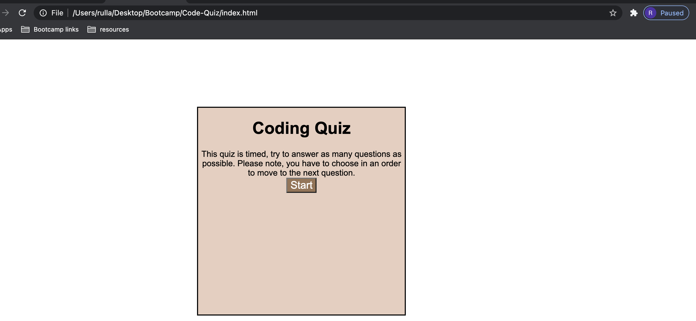

# Summary:
This app is a timed coding quiz on Javascript Fundementals. There are 5 multiple-choice questions in total. If the answer is not correct, the user will be penalized 10 seconds. 

# Technologies used:
- HTML
- CSS
- Javascript

# Deployed links:
https://github.com/rayaalsaedi/Code-Quiz

 https://rayaalsaedi.github.io/Code-Quiz/

 # Screenshot:

